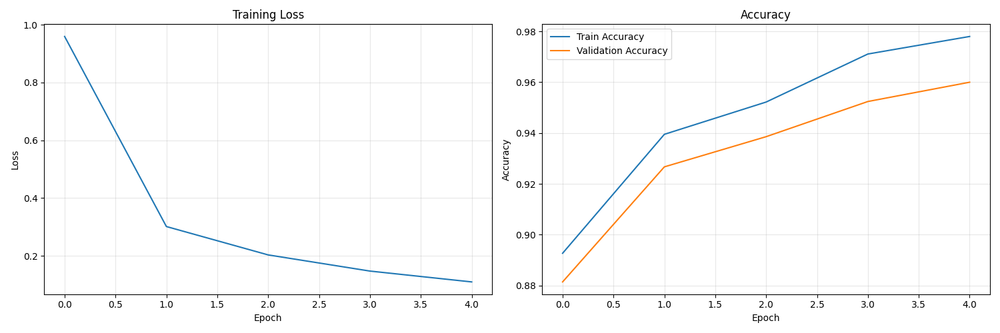
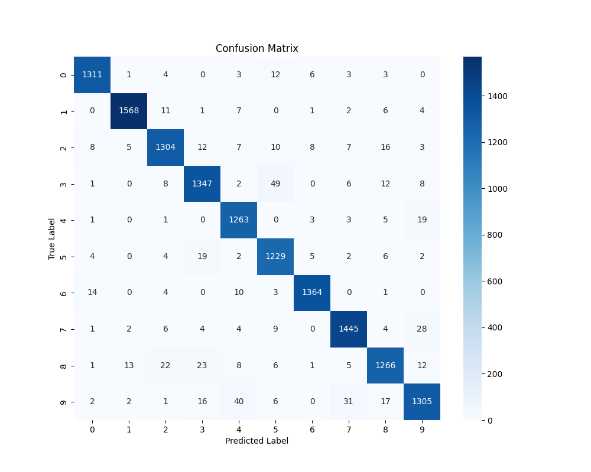
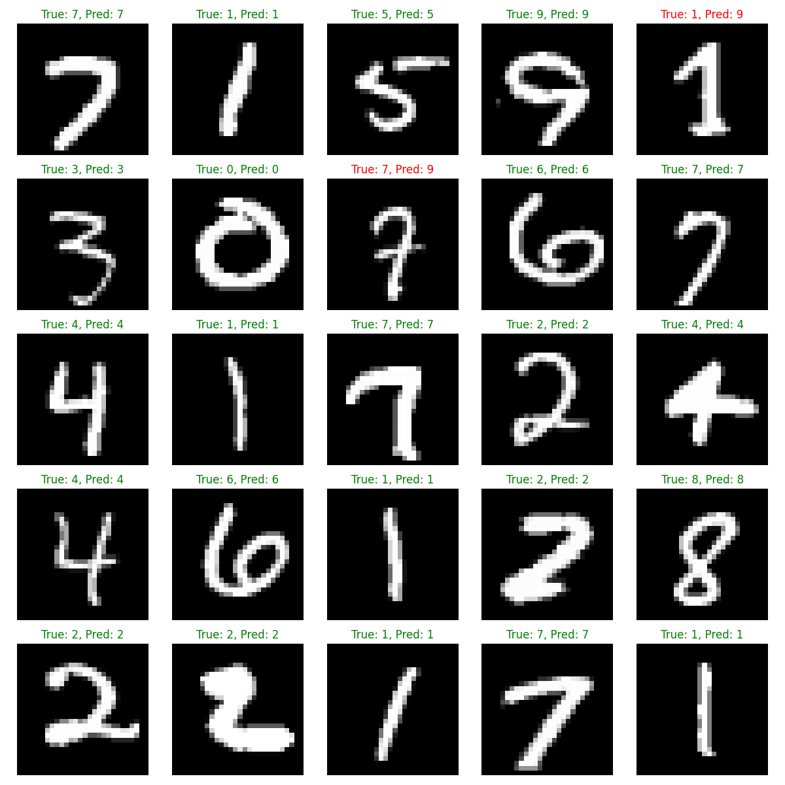
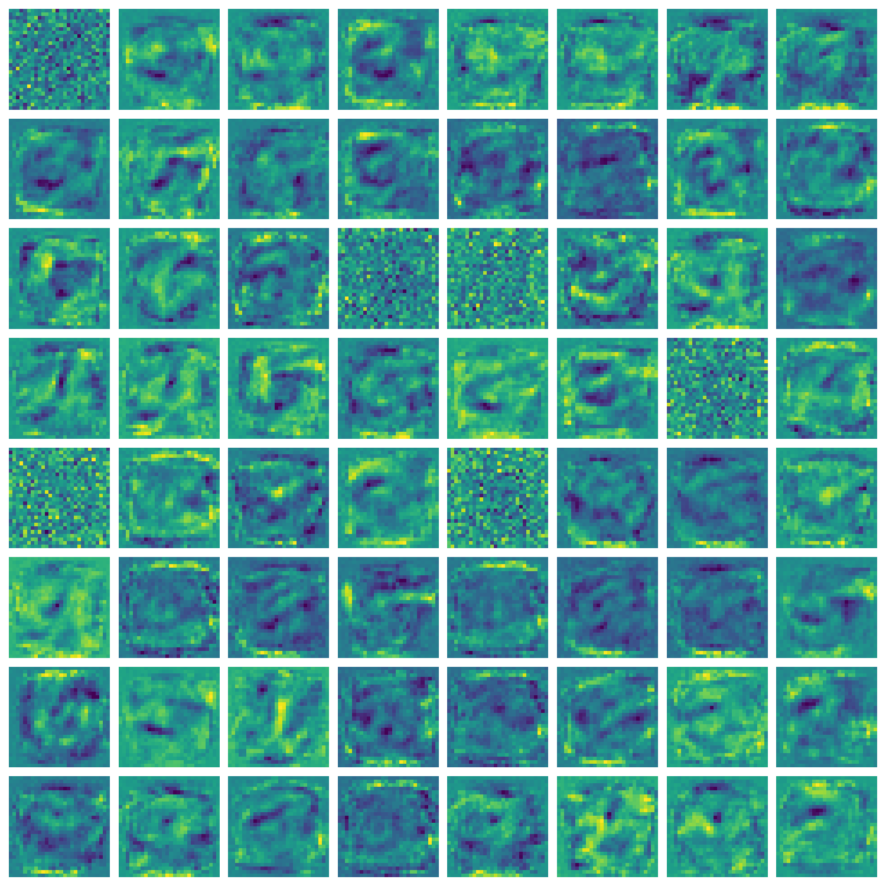

# Neural Network from Scratch

This project implements a neural network from scratch using NumPy. The network architecture is designed for the MNIST dataset with the following structure:

- Input layer (784 neurons)
- Dense layer (256 neurons, ReLU activation)
- Dense layer (128 neurons, ReLU activation)
- Dense layer (64 neurons, ReLU activation)
- Dense layer (32 neurons, ReLU activation)
- Output layer (10 neurons, Softmax activation)

## Features

- Neural network implemented from scratch with NumPy
- Adam optimizer
- Categorical Cross Entropy loss function
- Mini-batch gradient descent
- Training progress visualization
- Comprehensive model evaluation visualizations

## Requirements

Install the required packages:

```bash
pip install -r requirements.txt
```

## Usage

The main script can be run directly:

```bash
python neural_network.py
```

This will:
1. Download the MNIST dataset (if sklearn is installed)
2. Train the neural network for 5 epochs
3. Evaluate the model and print the test accuracy
4. Generate comprehensive visualizations for model evaluation

## Test Results

When tested on the MNIST dataset, the network achieved the following performance:

```
Epoch 1/5, Loss: 0.9595, Train Acc: 0.8927, Val Acc: 0.8814
Epoch 2/5, Loss: 0.3014, Train Acc: 0.9395, Val Acc: 0.9267
Epoch 3/5, Loss: 0.2031, Train Acc: 0.9522, Val Acc: 0.9386
Epoch 4/5, Loss: 0.1472, Train Acc: 0.9711, Val Acc: 0.9524
Epoch 5/5, Loss: 0.1096, Train Acc: 0.9780, Val Acc: 0.9600
Test accuracy: 0.9573
```

The network achieved **95.73%** accuracy on the test set after just 5 epochs of training, demonstrating the effectiveness of this implementation despite its simplicity.

## Visualizations

### Learning Curves



The learning curves show both training loss and accuracy metrics. The loss curve shows rapid initial improvement followed by consistent convergence, while the accuracy curves demonstrate how the model steadily improves its performance on both training and validation data.

### Confusion Matrix



The confusion matrix visualizes the performance of the classification model by showing the counts of true vs. predicted classes. This helps identify which digits are most commonly confused with each other.

### Sample Predictions



This visualization shows random samples from the test set along with their true labels and model predictions. Correct predictions are shown in green, while incorrect ones are in red. This gives a qualitative assessment of the model's performance on individual examples.

### Feature Visualization



This visualization shows what patterns the first layer of the neural network has learned. Each image represents the weights of a neuron in the first hidden layer, reshaped to the original input dimensions (28x28). This provides insight into what features the model is using to make predictions.

## Training Performance

The training shows excellent convergence:
- Initial loss starts relatively high (0.9595) as expected
- By epoch 2, loss is reduced dramatically (0.3014)
- Continues to improve steadily through epochs 3-5
- Final loss of 0.1096 indicates good model fit
- Training accuracy reaches 97.80% with validation accuracy at 96.00%, indicating good generalization

## Custom Implementation

You can also use the neural network for your own projects:

```python
# Import the module
from neural_network import NeuralNetwork, DenseLayer

# Create a model
model = NeuralNetwork()
model.add(DenseLayer(input_size, hidden_size, activation='relu'))
model.add(DenseLayer(hidden_size, output_size, activation='softmax'))

# Train the model
model.train(X_train, y_train, epochs=10, batch_size=32, learning_rate=0.001)

# Evaluate the model
accuracy = model.evaluate(X_test, y_test)
print(f"Accuracy: {accuracy:.4f}")
```

## Implementation Details

The implementation includes:
- Forward and backward propagation
- ReLU and Softmax activation functions
- Categorical Cross Entropy loss
- Adam optimizer for parameter updates
- Comprehensive visualization tools for model evaluation 